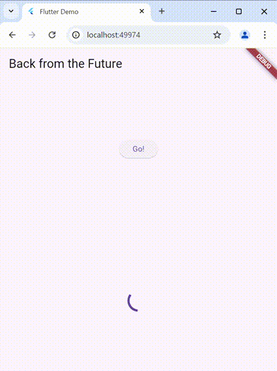
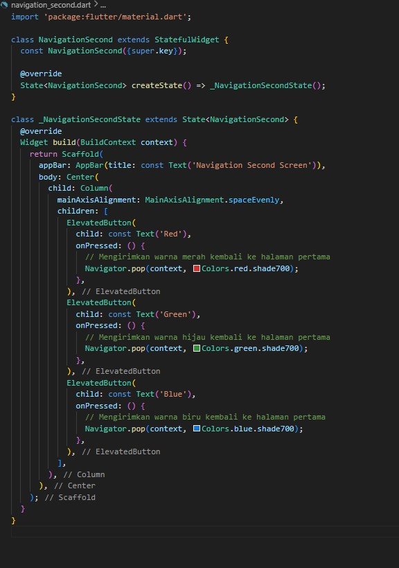
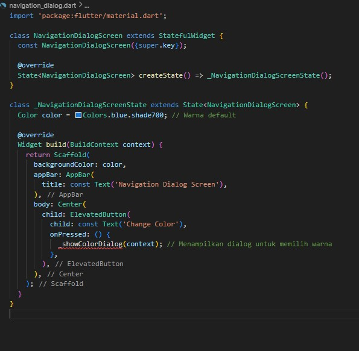

# Pemrograman Asynchronous

## Praktikum 1: Mengunduh Data dari Web Service (API)

### Langkah 1: Buat Project Baru

### Langkah 2: Cek file pubspec.yaml

### Langkah 3: Buka file main.dart

**Soal 3:**

Tambahkan nama panggilan Anda pada title app sebagai identitas hasil pekerjaan Anda.

### Langkah 4: Tambah method getData()

class \_FuturePageState

Soal 2:

Carilah judul buku favorit Anda di Google Books, lalu ganti ID buku pada variabel path di kode tersebut.

### Langkah 5: Tambah kode di ElevatedButton

**Soal 3**

Jelaskan maksud kode langkah 5 tersebut terkait substring dan catchError!

- substring(0, 450)

  - Mengambil 450 karakter pertama dari respons API agar data yang ditampilkan tidak terlalu panjang.
  - Berguna untuk membatasi tampilan data yang besar.

- catchError

  - Menangani error jika getData() gagal (contoh: jaringan bermasalah atau API error).
  - Jika terjadi error, variabel result diisi dengan teks "An error occurred" dan UI diperbarui dengan setState.

---

### Langkah 1: Buka file main.dart

class \_FuturePageState

### Langkah 2: Tambah method count()

### Langkah 3: Panggil count()

onPressed()

### Langkah 4: Run

**Soal 4**

Jelaskan maksud kode langkah 1 dan 2 tersebut!

- Langkah 1: Masing-masing method menunggu 3 detik dan mengembalikan angka.

- Langkah 2: Semua angka dijumlahkan secara berurutan, dan hasilnya ditampilkan di UI. Total waktu eksekusi adalah sekitar 9 detik.

---

## Praktikum 3: Menggunakan Completer di Future

### Langkah 1: Buka main.dart

### Langkah 2: Tambahkan variabel dan method

class \_FuturePageState

### Langkah 3: Ganti isi kode onPressed()

### Langkah 4: Run

### Langkah 5: Ganti method calculate()

### Langkah 6: Pindah ke onPressed()

**Soal 6**

Jelaskan maksud perbedaan kode langkah 2 dengan langkah 5-6 tersebut!

- Langkah 2 menggunakan Completer untuk menyelesaikan Future secara manual, dengan asumsi bahwa proses akan selalu berhasil (tanpa error handling).

- Hasil Future adalah 42 setelah 5 detik.
  Langkah 5-6 memperkenalkan penanganan error dengan try-catch di dalam calculate(). Jika terjadi error, Completer akan dipanggil dengan error, dan di onPressed(), kita menangani hasil atau error dengan then dan catchError.

---

## Praktikum 4: Memanggil Future secara paralel

### Langkah 1: Buka file main.dart

### Langkah 2: Edit onPressed()

### Langkah 3: Run

**Soal 7**

### Langkah 4: Ganti variabel futureGroup

**Soal 8**

Jelaskan maksud perbedaan kode langkah 1 dan 4!

- Penggunaan FutureGroup (Langkah 1) adalah metode kustom yang lebih eksplisit untuk mengelola dan menutup futures dalam grup. Anda harus menambahkan futures secara manual dan menutup grup setelah semua ditambahkan.

- Future.wait() (Langkah 4) adalah metode built-in Dart yang lebih sederhana dan langsung untuk menangani beberapa futures secara paralel. Ini mengembalikan Future yang selesai setelah semua futures dalam daftar selesai, tanpa perlu menambahkan atau menutup futures secara eksplisit.

---

## Praktikum 5: Menangani Respon Error pada Async Code

### Langkah 1: Buka file main.dart

### Langkah 2: ElevatedButton

### Langkah 3: Run

**Soal 9**

### Langkah 4: Tambah method handleError()

**Soal 10**

Panggil method handleError() tersebut di ElevatedButton, lalu run. Apa hasilnya? Jelaskan perbedaan kode langkah 1 dan 4!

- Langkah 1 (Method returnError):

  - Hanya melemparkan exception setelah penundaan.
  - Tidak ada penanganan error dalam method ini. Ini hanya menyebabkan error.

- Langkah 4 (Method handleError):

  - Menangani error dengan blok try-catch.
  - Menangkap exception dari returnError() dan memperbarui UI dengan pesan error.
  - finally block selalu dijalankan untuk menampilkan "Complete" setelah proses selesai, terlepas dari apakah terjadi error atau tidak.

---

## Praktikum 6: Menggunakan Future dengan StatefulWidget

### Langkah 1: install plugin geolocator

### Langkah 2: Tambah permission GPS

android/app/src/main/androidmanifest.xml

iOS/Info.plist

### Langkah 3: Buat file geolocation.dart

### Langkah 4: Buat StatefulWidget

Buat class LocationScreen di dalam file geolocation.dart

### Langkah 5: Isi kode geolocation.dart

**Soal 11**

Tambahkan nama panggilan Anda pada tiap properti title sebagai identitas pekerjaan Anda.

### Langkah 6: Edit main.dart

### Langkah 7: Run

### Langkah 8: Tambahkan animasi loading

**Soal 12**

1. Jika Anda tidak melihat animasi loading tampil, kemungkinan itu berjalan sangat cepat. Tambahkan delay pada method getPosition() dengan kode await Future.delayed(const Duration(seconds: 3));

2. Apakah Anda mendapatkan koordinat GPS ketika run di browser? Mengapa demikian?

   Tidak. Browser tidak memiliki akses langsung ke API perangkat keras seperti GPS. Namun, beberapa browser mendukung lokasi menggunakan Geolocation API berbasis jaringan (Wi-Fi atau IP). Untuk mengaktifkannya, pastikan Anda memberikan izin lokasi di browser.

3. Capture hasil praktikum Anda berupa GIF dan lampirkan di README. Lalu lakukan commit dengan pesan "W11: Soal 12".

---

## Praktikum 7: Manajemen Future dengan FutureBuilder

### Langkah 1: Modifikasi method getPosition()

### Langkah 2: Tambah variabel

### Langkah 3: Tambah initState()

### Langkah 4: Edit method build()

**Soal 13**

1. Apakah ada perbedaan UI dengan praktikum sebelumnya? Mengapa demikian?

   UI lebih efisien dan clean: Kode menjadi lebih ringkas karena FutureBuilder menyederhanakan logika pengambilan data dan tampilan UI.

   Responsive terhadap perubahan state Future: Tidak perlu banyak pengelolaan state manual.

   Kemudahan debugging: Error dapat langsung ditampilkan tanpa banyak kode tambahan.

2. Capture hasil praktikum Anda berupa GIF dan lampirkan di README. Lalu lakukan commit dengan pesan "W11: Soal 13".

3. Seperti yang Anda lihat, menggunakan FutureBuilder lebih efisien, clean, dan reactive dengan Future bersama UI.

---

### Langkah 5: Tambah handling error

**Soal 14**

1. Apakah ada perbedaan UI dengan langkah sebelumnya? Mengapa demikian?

   Sebelumnya (Tanpa Error Handling):

   UI hanya menampilkan animasi loading (CircularProgressIndicator) saat menunggu data, dan data posisi ketika berhasil ditemukan.
   Tidak ada mekanisme untuk menangani error jika terjadi masalah selama proses pengambilan lokasi (misalnya, jika layanan lokasi tidak aktif atau izin ditolak).

   Sekarang (Dengan Error Handling):

   UI sekarang menambahkan penanganan error, sehingga jika ada masalah selama pengambilan lokasi (misalnya, layanan lokasi dimatikan atau izin ditolak), akan menampilkan pesan error yang sesuai, seperti "Something terrible happened!".
   Tampilan yang lebih informatif dengan menampilkan pesan error ketika terjadi kegagalan, memberikan umpan balik yang jelas kepada pengguna.

2. Capture hasil praktikum Anda berupa GIF dan lampirkan di README. Lalu lakukan commit dengan pesan "W11: Soal 14".

---

## Praktikum 8: Navigation route dengan Future Function

### Langkah 1: Buat file baru navigation_first.dart

### Langkah 2: Isi kode navigation_first.dart

**Soal 15**

### Langkah 3: Tambah method di class \_NavigationFirstState

### Langkah 4: Buat file baru navigation_second.dart

### Langkah 5: Buat class NavigationSecond dengan StatefulWidget

### Langkah 6: Edit main.dart

### Langkah 8: Run

**Soal 16**

1. Cobalah klik setiap button, apa yang terjadi ? Mengapa demikian ?

   Ketika Anda mengklik salah satu tombol di halaman kedua (NavigationSecond), warna yang terkait dengan tombol tersebut akan dikirim kembali ke halaman pertama (NavigationFirst). Ini terjadi karena tombol pada halaman kedua menggunakan Navigator.pop() untuk "kembali" ke halaman pertama sambil mengirimkan data (warna).

2. Gantilah 3 warna pada langkah 5 dengan warna favorit Anda!

Saya mengganti warna dengan Pink, Ungu, dan Kuning.

3. Capture hasil praktikum Anda berupa GIF dan lampirkan di README. Lalu lakukan commit dengan pesan "W11: Soal 16".

---

## Praktikum 9: Memanfaatkan async/await dengan Widget Dialog

### Langkah 1: Buat file baru navigation_dialog.dart

### Langkah 2: Isi kode navigation_dialog.dart

### Langkah 3: Tambah method async

### Langkah 4: Panggil method di ElevatedButton

### Langkah 5: Edit main.dart

### Langkah 6: Run

**Soal 17**

1. Cobalah klik setiap button, apa yang terjadi ? Mengapa demikian ?

   StatefulWidget dan setState() memastikan bahwa perubahan yang terjadi dalam UI bisa langsung diterapkan ketika ada perubahan pada data atau status aplikasi (dalam hal ini, warna). Dengan setiap interaksi tombol, state baru diterapkan, dan tampilan diperbarui.

2. Gantilah 3 warna pada langkah 3 dengan warna favorit Anda!

3. Capture hasil praktikum Anda berupa GIF dan lampirkan di README. Lalu lakukan commit dengan pesan "W11: Soal 17".

